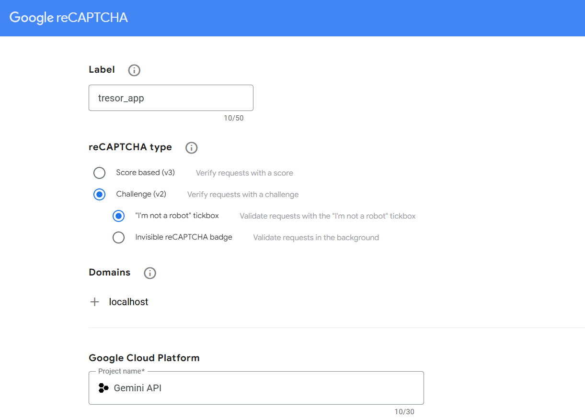

Dokumentation tresor-app Petr Cerny
---

## Passwort Hashing und Verifizierung

### Funktionsweise

#### Passwort Hashing
- Beim Hashing wird das Benutzerpasswort zusammen mit einem **Pepper** kombiniert, um die Sicherheit zu erhöhen. Das Pepper wird für jeden User neu generiert und mit den Userdaten in der DB gespeichert.
- Das Passwort wird mit **BCrypt** gehasht, und in der Datenbank zu speichern.
- Der **Pepper** wird als zusätzlicher Sicherheitsfaktor dem Passwort hinzugefügt, bevor es gehasht wird.

#### Passwort Verifizierung
- Bei der Verifizierung wird das eingegebene Passwort erneut mit dem **Pepper** kombiniert und mit dem gespeicherten Hash verglichen.
- Wird das kombinierte Passwort mit dem gespeicherten Hash übereingestimmt, gilt das Passwort als korrekt.

#### Sicherheit
- Der **Pepper** schützt das Passwort zusätzlich zum Hashing.

#### Passwortstärke
- Bei der Registrierung prüft das Backend die Passwortstärke.
- Das Passwort muss mindestens 8 Zeichen lang sein und mindestens einen grossbuchstaben, einen Kleinbuchstaben, eine Zahl und ein Sonderzeichen enthalten.
- Schwache Passwörter werden mit einer Fehlermeldung abgelehnt
- Eine ähnliche validierung erfolgt auch im Frontend per JavaScript.

---

## Benutzer-Login-Implementierung

### Funktionsweise

#### Frontend (React)
- Der Benutzer gibt E-Mail und Passwort ein.
- Diese Daten werden über eine **POST-Anfrage** an das Backend gesendet.
- Bei Erfolg wird der Benutzer weitergeleitet, bei Fehlschlag erfolgt eine Fehlermeldung.

#### Backend (Spring Boot)
- Das Backend sucht den Benutzer anhand der **E-Mail** und vergleicht das eingegebene Passwort mit dem gespeicherten Hash.
- Erfolgt die Übereinstimmung, wird eine Erfolgsmeldung zurückgegeben.

#### Passwortverifizierung
- Das eingegebene Passwort wird mit einem **Pepper** kombiniert und gehasht, um zusätzliche Sicherheit zu gewährleisten.

#### CORS-Konfiguration
- CORS wird aktiviert, um den Zugriff vom Frontend (z. B. `localhost:3000`) auf das Backend (z. B. `localhost:8080`) zu ermöglichen.

## Captcha

#### Meine Probleme

Nach dem erstellen des Secret&Site keys auf https://www.google.com/recaptcha/admin/site/722858598/setup kann man die Keys nutzen um ein Captcha ins Projekt einzuführen.

Leider gibt es eine "failed server Response" welche verhindert, dass der user gespeichert wird. 
Fürs Captch braucht es wiederum einen geöffneten Port vom Front zum Backend und die Keys ebenfalls für Front und Backend. 

Wie es eigentlich funktioniert ist, der Captcha-state wird beim call mitgegeben und überprüft bevor der User erstellw wird. 

Der Secretkey wird im Backend zusammen mit der URL gespeichert. Vom Frontend wird der SiteKey übergeben, womit beide Schlüssel nun überprüft werden ob es sich um das richtige paar handelt. Die beiden keys kann man sich auch als private-/publickey vorstellen.

## Secret encryption

### Funktionsweise

#### Encryption
Jeder User muss sich ja erst einloggen, bevor er secrets erstellen oder ansehen darf. Desshalb warum nicht das Passwort nehmen und den secret inhalt damit verschlüsseln. Ein secret ist ein JSON wobei die values verschlüsselt werden. 
Mit einem EncryptUtil werden nun die values des secrets mit dem Passwort verschlüsselt. Somit ist schliesslich die user_id, secret_id, value, etc. alles verschlüsselt.

#### *Bsp (ercrypted):*
{**"url"**:"wT5cCe6eKVXxLIjFCY4TZMAXp8brpAKBK3+iFeu2JpaGw8vDC3GmCLgq/ZEsJqiS:PBd3ayUhWWnfzch0pboqEA==", \
**"kind"**:"r7kkn4yukPUaSDSnTl45PXjp/K5nBmfF/84yd5lG+kuB0BkqSQbB4jUfLMg1gQ4d:jnQfwsE3bqE8obYMvsrkWg==",  \
**"kindid"**:"ovEIofiNqkSquqGdymHdhKU2JJfDwmTAy7fjEJaLK8DG5blcRm9rnOTOEwyJmXnE:VAgAXXE8lmGZpTF/vmkAKw==",  \
**"password"**:"o3axwzPGEjjQ4YZD9SjAoB42/hDJAuddRH3KvwTpFZIUVjXY71xghFzbn52/bbXc:S+ePwTgXbHqZSOXoBaolbA==",  \
**"userName"**:"XqOMMxpMYGnd6x+4r8XrUYsTxUuLhAxHO9QAkVvcnszEK4AVzVrD/BMHwh9qpk5i:ER2vT7EnGzLBLU0s3HAtlA=="}

#### Decryption
Bei der Decryption verläuft es genau gleich. die values werden mithilfe des passwort wieder entschlüsselt. Zusätslich im backend werden die secrets nach der korrekten user_id abgesucht, bevor diesen decryptet werden. Ich habe mich entschieden die Secrets der User nach ihren Mailadressen abzusuchen. Dabei könnte man jedoch jedes andere Attribut wählen

#### *Bsp (decrypted):*

{\"url\":\"www.URL.com\",
\"kind\":\"credential\",
\"kindid\":\"1\",
\"password\":\"qwer\",
\"userName\":\"hand\"}

Ein secret hat natürlich noch eine eigene ID in der db und eine user_id: die ID des Users welcher das secret erstellt hat. Durch diese kann man auch das richtige secret dem richtigem User zuordnen.

Schlussendlich kommt das secret im Tabellenformat heraus (hat chatgpt gemacht. Dafür habe ich keine Nerven)